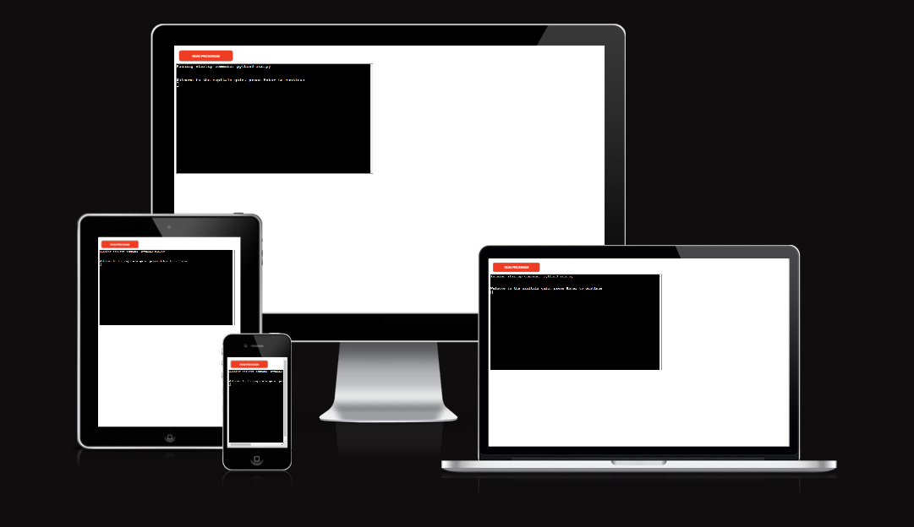
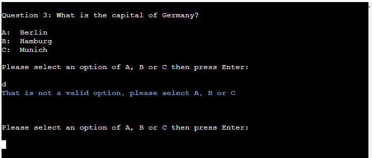

# Capitals Quiz 
Capitals Quiz is a Python terminal quiz, which runs in the Code Institute mock terminal on Heroku. 

[Here is the live version of the project](https://johns-capitals-quiz-91df1cc5b9af.herokuapp.com/)

## How to play 
Users are asked what the capital is of 10 countries and are given a selection of 3 potential answers, listed as A, B and C. One of the answers shall be the capital and therefore the correct answer while the other two options shall be incorrect answers. The other two options however are both cities in that particular country. 

Features: 

Instructions on how to paly the game 

The question is asked 

If the player selects the correct option, the player is notified of this, is given a score of 1 for that question and then the next question is generated. 

If the player selects the incorrect option, the player is notified of this, is advised that the score remains as it previously was and the next question is generated. 

If the player selects anything other than a/A, b/B or c/C, the player is notified that what they have selected is not an option and is asked to select A, B or C again until they select a/A, b/B or c/C. 

Simiarly, if the player doesn't select anything and just presses Enter, the player is notified that what they have selected is not an option and is asked to select A, B or C again until they select a/A, b/B or c/C. 

At the end of the quiz

The player is given their final score out of 10

## Testing 
I have manually tested this project by doing the following: 
-   Passed the code through a PEP8 linter and confirmed there are no problems
-   Given invalid inputs (including selecting nothing and just pressing return) 
-   Tested in my local terminal and the Code Institute Heroku terminal 

| Test  | Section  | Action  | Result  | Pass/Fail  |
|---|---|---|---|---|
| 1  |  Question | Entered the correct option in lower case  | Advised that the correct option was entered and gave one point  | Pass  |
| 2  |  Question | Entered one of the incorrect options in lower case | Advised that the correct option was not entered and advised that the points remained as they were before  | Pass  |
| 3  |  Question | Entered the other incorrect option in lower case | Advised that the correct option was not entered and advised that the points remained as they were before  |  Pass |
| 4  |  Question | Entered one of the incorrect options in upper case | Advised that the correct option was not entered and advised that the points remained as they were before  | Pass  |
| 6  |  Question | Entered the other incorrect option in upper case | Advised that the correct option was not entered and advised that the points remained as they were before  |  Pass |
|  7 |  Question  | Entered a character other than a/A, b/B or c/C   | Advised that what was entered was not a valid option and was prompted to enter A, B or C  |  Pass |
| 8  |  Question  | Entered multiple charachetrs including aa, bb, cc  | Advised that what was entered was not a valid option and was prompted to enter A, B or C  | Pass  |
| 9  |  Question  | Pressed Enter without entering any characters  | Advised that what was entered was not a valid option and was prompted to enter A, B or C  | Pass  |
|  10 | Question   | Repeated entering an invalid input multiple times  | Contnued to advise that what was entered was not a valid option and was prompted to enter A, B or C   |  Pass |

## Validator 
-   PEP8 
    -   No errors were returned from PEP8online.com

## Bugs 
When testing in PEP8, initial bugs such as 'unexpected Whitespace' and 'no newline at end of file' were easily resolved, multiple lines of code brought up the error 'line too long (xx > 79 characters)'.
Most of these lines going over column 80 contained a string of text.

These lines were shortend to below column 80 by using two methods:

The first method was to split the original print statement into to print() lines and adjoin them using the ', end=" "' method. 

This is what the code looked like before the error was fixed:

This is what the code looked like after the error has been fixed:

The second method was to create a variable and allocate the text to it then create a second line of code with the print() statement featuring an f-string and insert the variable into that.

This is what the code looked like before the error was fixed:

This is what the code looked like after the error has been fixed:

## Deployment 
This project was deployed using Code Institute’s mock terminal for Heroku
-   Steps for deployment: 
    -   Fork or clone this repository 
    -   Create a new Heroku app
	-   Set the build backs to Python and Node JS in that order
    -	Link the Heroku app to the repository
    -   Click on Deploy

## Credits 
-   Code Institute for the deployment terminal 
-   Patrick Rich for the video 'Beautiful Terminal Styling in Python With Rich' which was used to help with the colors and styling
-   The aforementioned Patrick Rich video can be found on [YouTube](https://www.youtube.com/watch?v=4zbehnz-8QU)
-   Code to clear the terminal from [Slack](https://stackoverflow.com/questions/2084508/clear-the-terminal-in-python)

## Thanks to
-   Mentor: Matthew Bodden 
